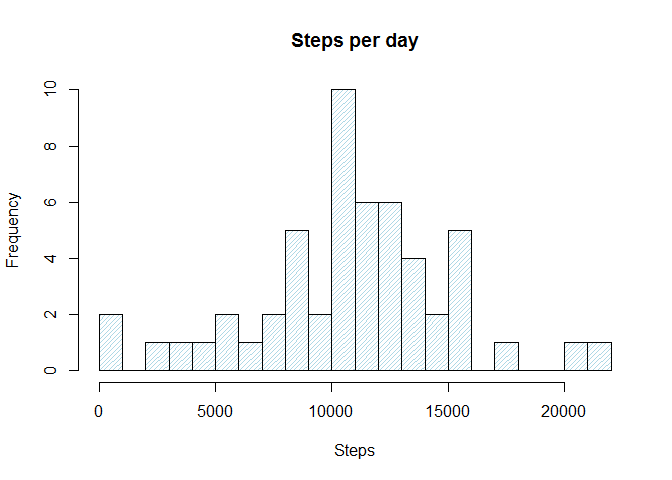
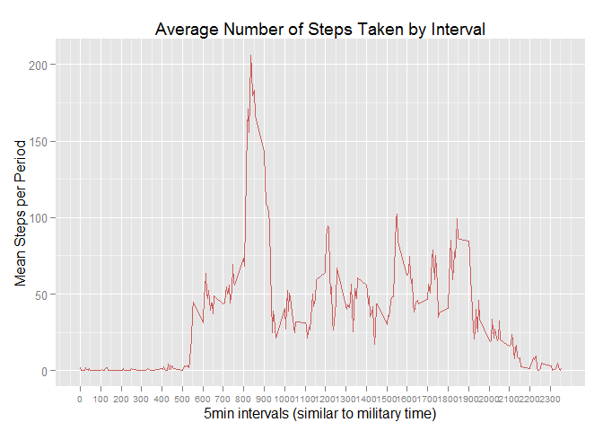
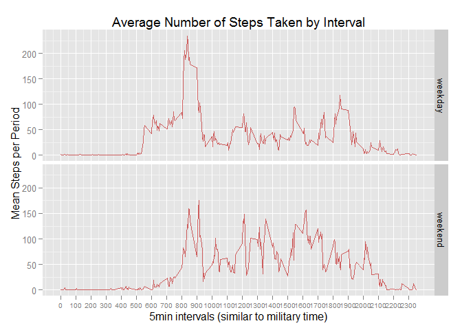

# Reproducible Research: Peer Assessment 1
Fernando DePaolis  


## Loading and preprocessing the data

```r
activity<- read.csv ("activity.csv", header=TRUE, sep=",")
attach(activity)
```


## What is mean total number of steps taken per day?

```r
summary(activity)
```

```
##      steps                date          interval     
##  Min.   :  0.00   2012-10-01:  288   Min.   :   0.0  
##  1st Qu.:  0.00   2012-10-02:  288   1st Qu.: 588.8  
##  Median :  0.00   2012-10-03:  288   Median :1177.5  
##  Mean   : 37.38   2012-10-04:  288   Mean   :1177.5  
##  3rd Qu.: 12.00   2012-10-05:  288   3rd Qu.:1766.2  
##  Max.   :806.00   2012-10-06:  288   Max.   :2355.0  
##  NA's   :2304     (Other)   :15840
```

```r
##Mean total number of steps per day
steps.day<-aggregate(steps~date, FUN=sum)
mean(steps.day$steps)
```

```
## [1] 10766.19
```

```r
median(steps.day$steps)
```

```
## [1] 10765
```

###Histogram of Steps taken per day

```r
hist(steps.day$steps, breaks = 20, 
     main = paste("Steps per day"), xlab = "Steps", 
     density = 30, angle=45, 
     border="black", col="lightblue")
```

 

## What is the average daily activity pattern?


```r
steps.interval <- aggregate(steps~interval, FUN=mean)
mean(steps.interval$steps)
```

```
## [1] 37.3826
```


###Line chart of Steps Taken

```r
ggplot(mapping = aes(x = unique(activity$interval), y = steps.interval$steps)) + 
        geom_line(col="indian red") + scale_x_continuous("5min intervals (similar to military time)", breaks = seq(min(unique(activity$interval)), max(unique(activity$interval)), 100)) + 
        scale_y_continuous("Mean Steps per Period") + ggtitle("Average Number of Steps Taken by Interval") + theme(axis.text.x = element_text(size = rel(.75), angle = 00))
```

 


## Imputing missing values
[based on solution at http://grokbase.com/t/r/r-help/0969yezzan/r-how-to-substitute-missing-values-nas-by-the-group-means]

```r
activity2 <- activity

as.numeric(apply(activity2, 1, function (x)
        ifelse( is.na(x[2]),
        tapply(activity2$steps,activity2$interval,
        mean, na.rm=TRUE)[x[1]],
        x[2])))

attach(activity2)
steps.day2<-aggregate(steps~date, FUN=sum)
```

```r
mean(steps.day2$steps)
```

```
## [1] 10766.19
```

```r
median(steps.day2$steps)
```

```
## [1] 10765
```
###Histogram "AFTER" imputing data to missing valus

```r
hist(steps.day2$steps, breaks = 20, 
     main = paste("Steps per day"), xlab = "Steps", 
     density = 30, angle=45, 
     border="black", col="lightblue")
```

 

## Are there differences in activity patterns between weekdays and weekends?
###Assigning days of the week (weekday/weekend) to dates

```r
activity2$day.type <- ifelse(weekdays(as.Date(activity2$date)) %in% c("Saturday", "Sunday"),"weekend","weekday")
```

###Line chart panels by type of day of the week

```r
activity3 <- activity2 %>% group_by(interval, day.type) %>% summarise(meanSteps = mean(steps, na.rm = TRUE))

ggplot(data = activity3, mapping = aes(x = interval, y = meanSteps)) + 
        geom_line(col="indian red") + facet_grid(day.type ~ .) + scale_x_continuous("5min intervals (similar to military time)", breaks = seq(min(activity3$interval), max(activity3$interval), 100)) + 
        scale_y_continuous("Mean Steps per Period") + ggtitle("Average Number of Steps Taken by Interval") + theme(axis.text.x = element_text(size = rel(.75), angle = 00))
```

 

